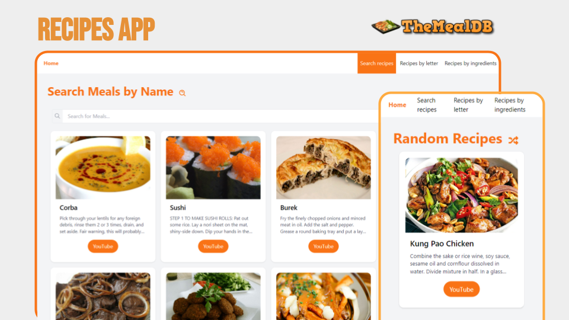

  <h1 >Recipes APP 🍱</h1>

 

  

## Tecnologies

- React.js
- TypeScript
- Tailwind
- Vite

## Overview

A responsive recipe website that allows users to search for recipes by name, first letter, and ingredients. The recipes are sourced from TheMealDB API, ensuring a wide variety of culinary options for users.
This platform aims to provide an intuitive and user-friendly experience for individuals interested in exploring and cooking new dishes.

## Installation

To run the project locally, follow the steps below:

1. Make sure you have Node.js installed on your system.

2. Clone this repository to your local machine.

3. Access the project folder via the terminal.

4. Install project dependencies with the following command:

   `npm install`

5. After the installation, run the project with the command:

   `npm run dev`

6. Access the application in your browser through the following address http://localhost:5173/.
